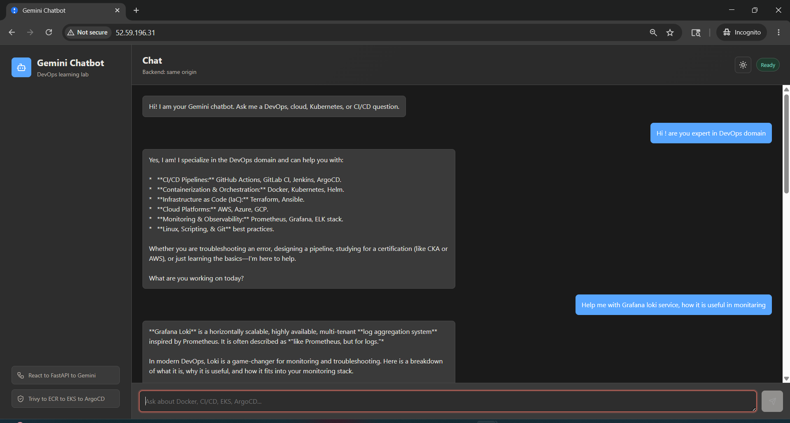
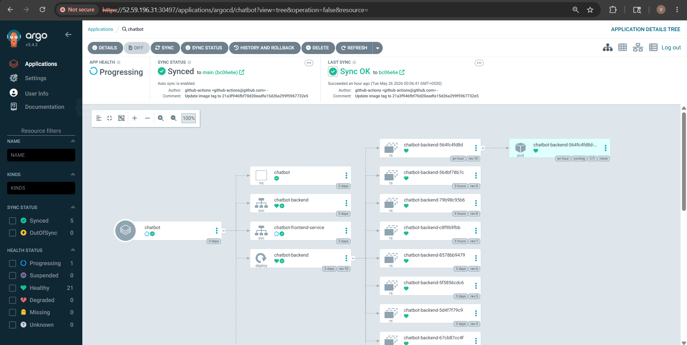
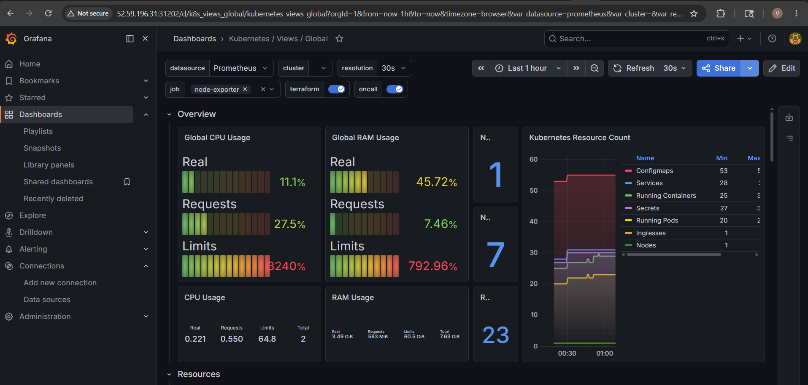
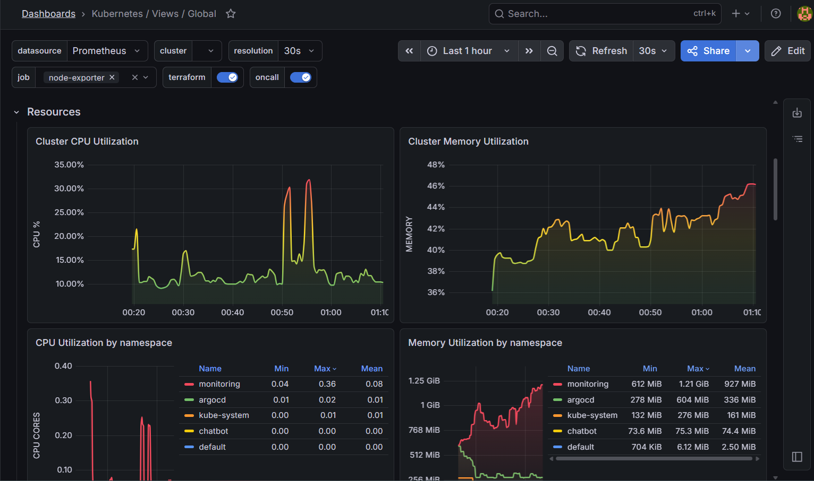
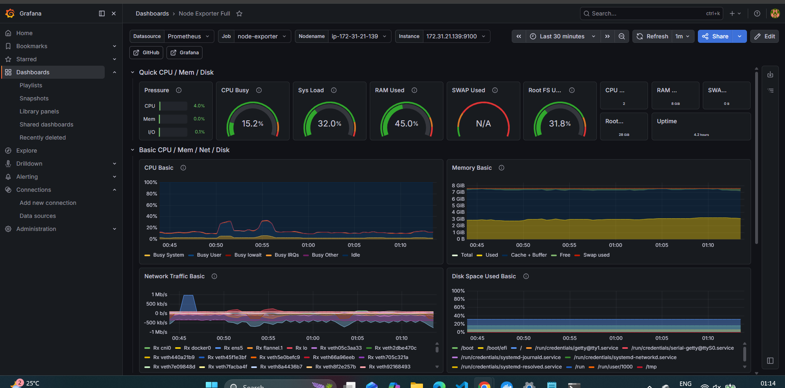
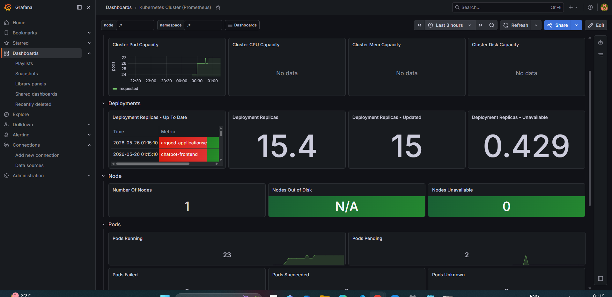

# Gemini Chatbot DevOps Lab

A full-stack chatbot project built for learning CI/CD from local development to K3s.

## Stack

| Layer | Technology |
| --- | --- |
| Frontend | React + Vite |
| Backend | FastAPI |
| AI | Gemini API |
| Infra | K3s on a VM or local lab machine |
| CI/CD | GitHub Actions |
| Registry | GitHub Container Registry |
| Kubernetes | K3s |
| GitOps | ArgoCD |
| Monitoring | Prometheus + Grafana |
| Logging | Loki |
| Security | Trivy |

## Local Run

Your existing `.env` can stay at the repo root. It should include `GEMINI_API_KEY`.

```powershell
docker compose up --build
```

Open:

- Frontend: http://localhost:5173
- Backend health: http://localhost:8000/health
- Backend metrics: http://localhost:8000/metrics

Without Docker:

```powershell
cd backend
python -m venv .venv
.\.venv\Scripts\Activate.ps1
pip install -r requirements.txt
uvicorn app.main:app --reload
```

```powershell
cd frontend
npm install
npm run dev
```

## CI/CD Learning Flow

1. Run locally with Docker Compose.
2. Push code to GitHub.
3. CI runs tests, builds images, scans with Trivy, and pushes to GHCR.
4. Update Kubernetes image tags under `k8s/overlays/k3s`.
5. ArgoCD syncs manifests into K3s.
6. Prometheus scrapes `/metrics`; Grafana visualizes backend traffic.
7. Loki collects container logs.

## Repo Map

- `backend/` FastAPI API, Gemini integration, tests, Dockerfile.
- `frontend/` React chatbot UI, Dockerfile, Nginx config.
- `k8s/` Kustomize base and K3s overlay.
- `docs/k3s-production-route.md` K3s-first deployment guide.
- `docs/argocd-k3s-flow.md` ArgoCD and K3s GitOps flow.
- `terraform/` Optional AWS reference infrastructure; not needed for the current K3s route.
- `argocd/` ArgoCD application manifest.
- `.github/workflows/` GitHub Actions pipeline.
- `monitoring/` Helm values for kube-prometheus-stack and Loki.

## Secret Handling

Never commit `.env`. In Kubernetes, create the Gemini secret:

```powershell
kubectl apply -f k8s/base/namespace.yaml
kubectl create secret generic gemini-secret --from-literal=GEMINI_API_KEY="your-key" -n chatbot
kubectl create secret docker-registry ghcr-creds --docker-server=ghcr.io --docker-username="your-user" --docker-password="your-token" -n chatbot
```

For CI, store credentials in repository secrets or CI variables.

App Snapshots:


argocd snaps:


monitoring dashbords :
https://snapshots.raintank.io/dashboard/snapshot/ju42qsaKEO5L1zuFlediICu6Sk6LpIyD



